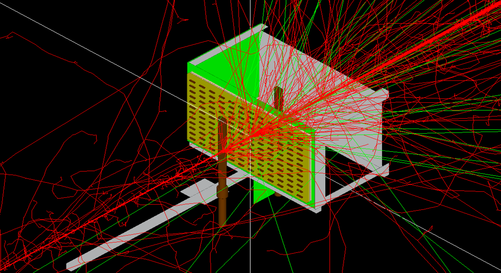
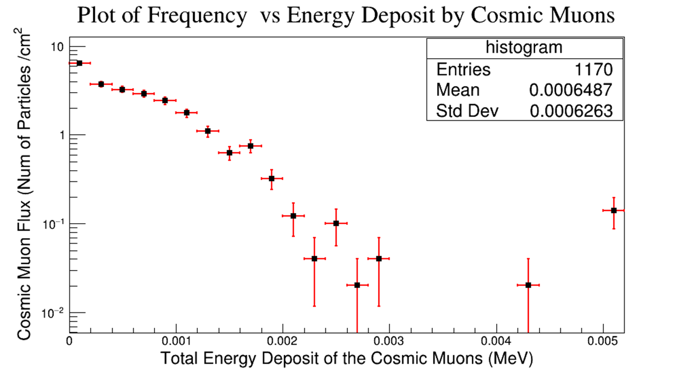

<h1> CosmicMuon Detection with Co-FPMD in GEANT4 </h1>

This rpositry contains the works done by me under Dr. Sanjib Muhuri during my summer Internship (2023) at <b>Variable Energy Cyclotron Center, Kolkata </b>.

<h2> Abstract </h2>
    <i>This internship report presents a comprehensive study on the detection of 
    cosmic muons using the CoFPMD (Cosmic Flux Photon Multiplicity Detector). 
    The primary objectives were to construct the detector setup, investigate 
    the energy deposit by muons at various incidence energies, and simulate 
    the actual data from EcoMug to improve the detector's performance.
    The internship commenced with the construction of the CoFPMD detector, 
    which consists of a honeycomb gas detector filled with Argon and CO2. 
    Geant4, a powerful simulation toolkit, was utilized to replicate the 
    detector's geometry and model the interaction of cosmic muons with the 
    detector materials. The fParticleGun was employed to simulate the 
    firing of muons with different incidence energies, enabling the 
    assessment of their energy deposit patterns within the detector.
    The first phase of the internship involved analyzing the energy deposit by 
    muons for different incidence energies. The obtained results provided valuable 
    insights into the behavior of cosmic muons and their interaction with the Argon 
    and CO2 gas mixture. The data facilitated the understanding of the detector's 
    response to muon incidence at various energy levels.
    In the second phase, data from Simulation in EcoMug, containing momentum, 
    position, and energy information, was implemented in the Geant4 fParticleGun. 
    This implementation allowed for the generation of realistic muon events, 
    which closely represented the characteristics of actual cosmic muons. By 
    incorporating real data, the accuracy of the simulation was enhanced, 
    resulting in a more reliable representation of the detector's performance.
    Based on the simulated data, a plot of the energy deposit by muons 
    was generated. This plot not only demonstrated the sensitivity and 
    efficiency of the CoFPMD detector in capturing cosmic muons but also 
    highlighted the correlation between energy deposition and muon incidence energies.
    In conclusion, this internship has provided valuable hands-on experience in the field of cosmic muon detection and its simulation using Geant4. The results obtained through this study offer a solid foundation for future research and advancements in the realm of cosmic muon detection and particle physics.
    </i>
    

<h2> Simulation Geometry </h2>

The detector that is being used in the lab, is a Cosmic flux Photon Multiplicity Detector (CoF-PMD) which  will be used to detect and monitor cosmic muon flux. The muons will be detected using the gas detector array which uses Ar+CO2 (9:1) mixture as the active medium to sense incidence of the ionising particles. To mimic the similar detector arrangement, the gas mixture was declared as the Sensitive detector in the geant4 simulation as the Logical volume. The Sensitive Detector will provide the position of incidence and the total  energy deposition and thus will be used in flux calculation.

The CoFPMD detector comprises honeycomb-shaped arrays gas detector layers with two trigger scintillators placed on either side. Ionization-generated signals are collected at each cell the central gold wire, serving as the gas detector's anode relative to the common copper wall of the honeycomb cells. The hexagonal layer has a 2.5mm inner radius, 5mm depth, while the central gold wire has a 10-micron radius. These structures are constructed using G4Polyhedra and G4Tubs. The trigger scintillators, located 11cm above and below the detector layer, have dimensions of 1cm in thickness and 11cm in length as shown in Fig-1

<figure>
   
   <figcaption style="font-family: 'Times New Roman', Times, serif;"><b> Fig-1: Set up of the Geometry used in the Simulation </b></figcaption>
</figure>

<h2> Results </h2>

From the simulations, the energy deposition by the Cosmic muons in each cell is obtained, and a plot of flux vs energy deposition is obtained which is shown in the Figure-2. The input of the Cosmic muons was taken from EcoMug, a standalone header file meant to generate atmospheric muon with the initial position, momentum and the angles. The data so obtained is fed as input to the Geant4 and the cosmic muons are fired. Also the muons which have no chance of hitting the detector is omitted from the input. The muons falling on the scintillation is detected by the honeycomb gas mixture, and the energy deposit is calculate with a genat4 cut value of 1mm.

<figure>
   
   <figcaption style="font-family: 'Times New Roman', Times, serif;"><b> Fig-2: Cosmic Muon Flux </b></figcaption>
</figure>

<h2> Conclusion </h2>

In conclusion, from the Figure-2,  our study has revealed that the incident energy of cosmic muons typically falls within the range of a few hundred MeV to 5 GeV. The details of the simulation done with geant4, will be presented in the conference along the actual experimental facility developed at VECC.